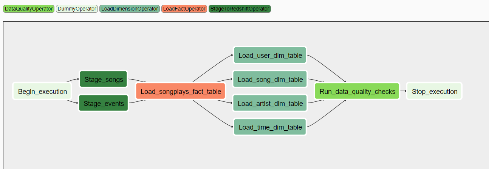

## Introduction
A startup called Sparkify has been collecting data on songs and user activity in JSON format. They are interested in efficiently performing song play analysis. Specifically, they want to know which songs do users prefer.

The goal of the current project is to create a data pipeline using a Workflow Manager tool like Airflow that would allow Sparkify to schedule their ETL workflows.

## About the Source Data
The dataset has been gathered from [Million Songs Dataset](https://labrosa.ee.columbia.edu/millionsong/) and logs simulated using 
[event simulator](https://github.com/Interana/eventsim)

## Project Description

The goal of the project is to design a database schema and implement an ETL pipeline that would optimize queries for song play analysis.

## Database Design


This is called a star schema, which is the industry standard for optimizing the desired queries. The table at the center is the *Fact* table 
(songplays) which contains the foreign keys to the *four dimension* tables. Through this design analytical queries such as the following are easy
to execute using simple joins.

~~~~sql
SELECT first_name, last_name, COUNT(*) AS counts 
FROM (songplays LEFT JOIN time ON songplays.start_time = time.start_time)
    LEFT JOIN users ON songplays.userid = users.userid 
GROUP BY first_name, last_name, weekday 
WHERE time.weekday='5' 
ORDER BY counts DESC LIMIT 5;
~~~~

This query would return the top 5 active users on Fridays.

## Airflow DAG execution 
The following tasks are performed to transform the raw songs and logs JSON and save in Redshift

1. Copy the songs data and events data from s3 to staging tables in Redshift
2. Load the fact table from staging tables
3. Load the dimmension tables from staging tables
4. Validate the pipeline through data quality checks

A schematic view is as below:




## Usage

### Redshift Cluster setup

To use the script make sure that the Redshift cluster is setup and has staging, fact, and dimmensions table.

You can also create a Redshift cluster by executing the cells of `setup_AWS.ipynb` notebook. The notebook reads the following configuration from `dwh.cfg` (DWH section)

```
DWH_CLUSTER_TYPE=         e.g. multi-node
DWH_NUM_NODES=            e.g. 4
DWH_NODE_TYPE=            e.g. dc2.large

DWH_IAM_ROLE_NAME=        e.g. dwhRole
DWH_CLUSTER_IDENTIFIER=   e.g. dwhCluster
DWH_DB=                   Database Name
DWH_DB_USER=              Database user
DWH_DB_PASSWORD=          Database Password
DWH_PORT=                 Database Port
```
**Note: You can also create and attach the IAM role through the code in the same notebook**

### Create Tables

Tables can be created by either executing `create_tables.sql` in Redshift or the cells of `create_tables.ipynb` notebook.
To use the notebook, you will need to set the `Cluster` section configuration in `dwh.cfg` file.

```
HOST= {Redshift Endpoint}
DB_NAME= Database Name
DB_USER= Database User
DB_PASSWORD= Database Password
DB_PORT= Database Port
``` 

### Execute DAG
Start Airflow Server (`/opt/airflow/start.sh`) and toggle on `sparkify_dag` 
